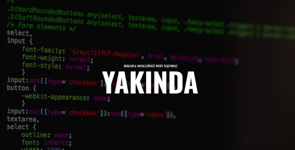

# Yakında Teması

Modern tasarımı ve kullanıcı dostu özellikleriyle, web sitenizi tanıtmak için mükemmel bir seçenek olan "Yakında Teması", HTML tabanlı temiz ve düzenli kod yapısıyla dikkat çekiyor.

## Özellikler

- **Modern Tasarım:** Güncel ve şık tasarım öğeleri.
- **Kullanıcı Dostu:** Kolay navigasyon ve düzenlenebilir yapı.
- **HTML Tabanlı:** Temiz kodlar sayesinde hızlı ve sorunsuz kullanım.

## Kurulum

1. Proje dosyalarını indirin veya klonlayın.
2. `index.html` dosyası üzerinden düzenlemelerinizi yapın.
3. Web sunucunuza yükleyerek temayı yayına alın.

İyi çalışmalar!
## Görüntü

